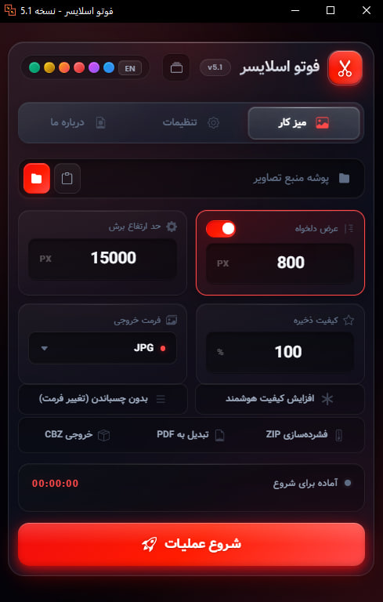

[🇮🇷 **Read in Persian (فارسی)**](README-fa.md)

# 📸 PhotoSlicer
### The Ultimate Manhwa & Webtoon Processing Tool (Go + Wails v2)

[](https://github.com/esmail-mkh/PhotoSlicer-Go/releases/latest)
[](https://github.com/esmail-mkh/PhotoSlicer-Go/releases/latest)
[](https://github.com/esmail-mkh/PhotoSlicer-Go)
[](<#-installation--downloads>)
[](https://go.dev/)
[](https://wails.io/)
[](LICENSE)

<p align="left">
  
</p>

**PhotoSlicer** is a blazing-fast, aesthetically stunning, cross-platform desktop application designed specifically for **Webtoon, Manhwa, and Manga translators, scanlation teams, and editors**. Completely rewritten in **Go** and **Wails v2**, it delivers pure native performance with an ultra-lightweight memory footprint and zero external runtime dependencies (no Python or heavy runtimes required).

It automates the entire webtoon production workflow: seamless vertical stitching, high-fidelity bicubic resizing, smart content-aware slicing without cutting through speech bubbles or artwork, flexible watermarking, dual-engine image enhancement, and multi-format exports.

---

## 📑 Table of Contents

* [✨ Key Features](#-key-features)
* [🚀 Core Capabilities](#-core-capabilities)
* [🖼️ Smart Watermarking System](#-smart-watermarking-system)
* [🎨 Stunning UI & UX](#-stunning-ui--ux)
* [🛠️ Power User Tools](#-power-user-tools)
* [⚡ Quick Start](#-quick-start)
* [📥 Installation & Downloads](#-installation--downloads)
* [🎮 How to Use](#-how-to-use)
* [📸 Watermarking Guide](#-watermarking-guide)
* [🎨 Presets System](#-presets-system)
* [🖼️ Themes & Customization](#-themes--customization)
* [🧩 Tech Stack](#-tech-stack)
* [☕ Support Me](#-support-me)
* [🤝 Contributing](#-contributing)

---

## ✨ Key Features

### 🚀 Core Capabilities

* **Native Go Architecture:** High-speed multi-threaded pipeline using Go goroutines and worker pools for 2x–3x faster processing, encoding, and sorting.
* **Smart Stitching:** Seamlessly merges fragmented vertical panels into continuous long strips.
* **Content-Aware Slicing:** Uses an intelligent boundary-detection algorithm (`Comparison Detector`) to identify safe cutting gaps (whitespaces and gutters) so speech bubbles and artwork are **never split in half**.
* **Dual-Engine Quality Enhancement:**
  * ⚡ **Fast Clean (CPU):** Instant built-in denoising and smoothing running efficiently across all CPU cores.
  * 🔥 **Real-ESRGAN (GPU):** State-of-the-art AI upscaler powered by NCNN Vulkan to upscale and clarify low-resolution artwork.
* **Format Mastery:** Supports input from **JPG, PNG, WEBP, AVIF,** and layered **PSD** files.
* **Multi-Mode Processing:**
  * **Single Mode:** Point to a folder of images to process a single chapter.
  * **Batch Mode:** Point to a parent directory containing multiple chapter folders; PhotoSlicer processes each chapter sequentially with full progress tracking.
* **No-Stitch Mode:** Process, resize, enhance, watermark, and slice images individually without stitching them into a vertical strip first.

### 🖼️ Smart Watermarking System

* **Segment-Distributed Placement:** Automatically calculates balanced placements across vertical segments of each slice.
* **Edge Alignment & Margins:** Align watermarks to the **Left Edge** or **Right Edge** with customizable pixel margin offsets (`0–200 px`).
* **Multi-Instance Support:** Place between `1` and `10` watermark instances per output slice.
* **Original PNG Fidelity:** Renders crisp transparent PNG logos scaled proportionally to canvas width with Lanczos filtering.
* **Editable PSD Layers:** When exporting to PSD, watermarks are preserved as independent, fully editable Photoshop layers.
* **Dynamic Pipeline Step:** The UI step indicator dynamically shows the **Watermark** phase when active.

### 🎨 Stunning UI & UX

* **Neon Aurora & Glassmorphism:** Modern translucent interface with dynamic background orbs, sleek borders, and subtle glow effects.
* **6 Built-in Neon Themes:** Switch instantly between **Cyber Blue**, **Electric Purple**, **Ruby Red**, **Sunset Orange**, **Luxury Gold**, and **Neo Emerald**.
* **Custom Theme Creator:** Built-in modal with a live color wheel, saturation slider, hex input, and a 10×10 curated palette with real-time preview and adaptive text contrast.
* **Bilingual Support:** Instant live switching between **English (EN)** and **Persian (FA)** without app restart.
* **Drag & Drop:** Drop folders directly onto the application with an animated glowing drop-zone overlay.
* **Directory Quick Actions:** Clear path, paste from clipboard, or browse with native dialogs.
* **Live Progress & Telemetry:** Real-time percentage, detail status, processed files counter (`X/Y`), current file name, elapsed timer, and dynamic ETA calculator.
* **Collapsible Workspace:** Progress area auto-collapses cleanly to keep the workspace compact.
* **Interactive Control Center:** **Pause**, **Resume**, or completely **Stop** active jobs at any time.

### 🛠️ Power User Tools

* **Custom Width & Resizing:** High-quality Bicubic resizing to custom widths (default: `800 px`), or toggle off to preserve original widths.
* **Configurable Slice Limits:** Set maximum slice height (default: `16,000 px`, with automatic WebP 16,383px and JPEG 65,500px safe capping).
* **Multiple Output Formats:** Export to **JPG**, **PNG**, **WEBP**, or layered **PSD**.
* **Bundled Packaging:**
  * 📦 **ZIP Archive:** Automatically archives all chapter slices into a clean `.zip` file.
  * 📑 **PDF Document:** Generates a unified long-strip PDF document for reading.
  * 📚 **CBZ Archive:** Produces comic book archives ready for comic reader apps.
* **Flexible Save Locations:**
  * Default `./Results` directory next to the executable (or Documents folder).
  * Custom destination path.
  * **Save Next to Source:** Places results directly alongside original source folders with a customizable suffix (e.g. `[Stitched]`).
* **Advanced Output Filename Templates:**
  * Configure custom naming patterns using tokens: `[number]`, `[folder]`, `[date]`, `[total]`.
  * Customizable digit zero-padding (`1–6` digits, e.g. `001.jpg`).
  * Real-time preview of the output filename.
* **Thread & Performance Control:** Select active worker concurrency (`1–16` CPU threads).
* **Presets Management:** Save configurations, set default (starred) presets for startup, and export/import presets via JSON.

---

## ⚡ Quick Start

### Run Pre-compiled Binary
No installation or dependencies required:

1. Download the ZIP for your OS from the [Releases Page](https://github.com/esmail-mkh/PhotoSlicer-Go/releases/latest).
2. Extract the archive.
3. Run `PhotoSlicer.exe` (Windows), `./PhotoSlicer` (Linux), or `PhotoSlicer.app` (macOS).

---

## 📥 Installation & Downloads

### Option 1: Pre-compiled Standalone Packages

Download the latest release archive from [Releases](https://github.com/esmail-mkh/PhotoSlicer-Go/releases/latest):

| Operating System | Package Name | Executable Inside |
|:---|:---|:---|
| 🪟 **Windows (x64)** | `PhotoSlicer-v<Version>-Windows.zip` | `PhotoSlicer.exe` |
| 🐧 **Linux (x64)** | `PhotoSlicer-v<Version>-Linux.zip` | `./PhotoSlicer` |
| 🍎 **macOS (x64/ARM)** | `PhotoSlicer-v<Version>-macOS.zip` | `PhotoSlicer.app` |

> ℹ️ Each package comes bundled with the `up-model/` directory containing AI models.

---

### Option 2: Build from Source

#### Prerequisites

| Dependency | Minimum Version | Note |
|:---|:---:|:---|
| **Go** | `1.22+` | Backend language |
| **Wails v2** | `v2.9.0+` | Desktop runtime framework |
| **C Compiler** | MinGW-w64 (Windows), GCC (Linux), Clang (macOS) | Required by CGo |
| **System Libraries (Linux)** | `libgtk-3-dev`, `libwebkit2gtk-4.0-dev` (or `4.1`) | WebView dependencies |

#### 1. Clone the Repository
```bash
git clone https://github.com/esmail-mkh/PhotoSlicer-Go.git
cd PhotoSlicer-Go
```

#### 2. Install Wails CLI
```bash
go install github.com/wailsapp/wails/v2/cmd/wails@latest
```

#### 3. Run Live Development Mode
```bash
wails dev
```
Hot-reloading is enabled for both Go backend and frontend assets.

#### 4. Build Production Executable
```bash
wails build
```
The optimized standalone binary will be created in `build/bin/` (approx. 15–20 MB, zero external runtime dependencies).

---

## 🎮 How to Use

```
 ┌─────────────────────────────────────────────────────────────┐
 │ 1. Select Folder ──> 2. Settings ──> 3. Options ──> 4. Go!  │
 └─────────────────────────────────────────────────────────────┘
```

### 1️⃣ Select Source Directory
* Click the folder icon, paste a path from clipboard, or drag & drop a directory onto the application.
* **Single Mode:** If the folder directly contains images, PhotoSlicer processes it as a single chapter.
* **Batch Mode:** If the folder contains sub-folders, PhotoSlicer automatically identifies them and processes all chapters sequentially.

### 2️⃣ Configure Core Parameters

| Setting | Description | Default | Range / Values |
|:---|:---|:---:|:---:|
| **Width** | Target output width in pixels (Bicubic resize) | `800 px` | `100 – 10000 px` (or toggle off) |
| **Height Limit** | Maximum slice height before finding a cut point | `16000 px` | `1000 – 65000 px` |
| **Quality** | Image compression quality | `100 %` | `1 – 100 %` |
| **Format** | Output format | `JPG` | `JPG`, `PNG`, `WEBP`, `PSD` |

### 3️⃣ Additional Processing Options

* **AI Enhance:** Check to enable image enhancement. Choose between **Fast Clean (CPU)** or **Real-ESRGAN (GPU)** in the Settings tab.
* **No Stitch:** Slices and resizes individual images without stitching them into a vertical continuous strip first.
* **Package Formats:** Optionally wrap the output into a **ZIP Archive**, **PDF Document**, or **CBZ Archive**.

### 4️⃣ Initiate Processing!
Click the **🚀 INITIATE** button to start.
* Monitor progress with the progress bar, file counters, elapsed timer, and ETA.
* Use **Pause** / **Resume** or click **STOP** to halt processing immediately.
* Click **Open Folder** when done to inspect your sliced images.

---

## 📸 Watermarking Guide

PhotoSlicer features a high-performance watermarking system:

1. **Open Settings Tab:** Navigate to the **Watermark Settings** section.
2. **Enable Watermark:** Toggle **Enable Watermark** on.
3. **Select PNG:** Choose a transparent **PNG** image (e.g., scanlation group logo).
4. **Configure Layout:**
   * **Count Per Page:** Choose how many watermarks to place per output slice (`1` to `10`).
   * **Placement Edge:** Choose **Left Edge** or **Right Edge**.
   * **Edge Margin:** Adjust the horizontal distance from the chosen edge (`0` to `200 px`).
5. **Layered PSD Workflow:** When output format is set to **PSD**, watermarks are saved onto dedicated editable layers for quick retouching in Adobe Photoshop.

---

## 🎨 Presets System

Save, load, and share your complete processing configurations:

* **Save Preset:** Click the presets dropdown in the header, enter a name, and save your current width, height, quality, format, watermark, and packaging settings.
* **Load Preset:** Select any saved preset to restore all parameters instantly.
* **Starred Default:** Star your favorite preset so it is applied automatically every time PhotoSlicer launches.
* **Export / Import JSON:** Share presets across machines using the native Export/Import buttons in the Presets modal.

---

## 🖼️ Themes & Customization

### Built-in Neon Themes
* 🔵 **Cyber Blue** — Clean cyber aesthetic (Default)
* 🟣 **Electric Purple** — Vibrant vaporwave style
* 🔴 **Ruby Red** — High-contrast crimson
* 🟠 **Sunset Orange** — Warm amber glow
* 🟡 **Luxury Gold** — Elegant golden sheen
* 🟢 **Neo Emerald** — Cyberpunk terminal green

### Custom Theme Creator
Navigate to **Settings → Appearance → Custom Color** to design your own palette with the visual color wheel, saturation slider, hex input, and live UI preview with automated contrast adaptation.

---

## 🧩 Tech Stack

| Layer | Technology |
|:---|:---|
| **Language & Backend** | **Go 1.22+** (Goroutines, worker pools, native cross-platform runtime) |
| **Desktop Framework** | **Wails v2** (Native WebView2 on Windows, WebKitGTK on Linux, WebKit on macOS) |
| **Image Processing** | `github.com/disintegration/imaging`, pure-Go encoders & decoders |
| **Document & Container Encoders** | Pure-Go PDF, layered PSD, ZIP, and CBZ writers |
| **AI Upscaling** | **Real-ESRGAN** (NCNN Vulkan GPU) & **Fast Clean** (CPU engine) |
| **Frontend UI** | Modern HTML5, CSS3 Glassmorphism, Vanilla JavaScript |

---

## ☕ Support Me

If you love PhotoSlicer and want to support its ongoing development:

<p align="left">
  <a href="https://daramet.com/esmailmkh"></a>
  &nbsp;&nbsp;
  <a href="https://coffeebede.com/esmailmkh"></a>
</p>

---

## 🤝 Contributing

Contributions, feature requests, and bug reports are warmly welcomed!

* 🐛 **Report a Bug:** Open an issue on the [Issues](https://github.com/esmail-mkh/PhotoSlicer-Go/issues) page.
* 💡 **Feature Requests:** Submit ideas via [Discussions](https://github.com/esmail-mkh/PhotoSlicer-Go/discussions).
* 🔧 **Pull Requests:** Fork the repository, create your branch, and submit a PR.

Created with ❤️ by **E.MKH**.
